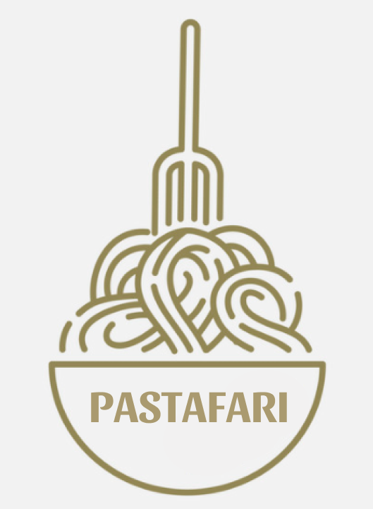
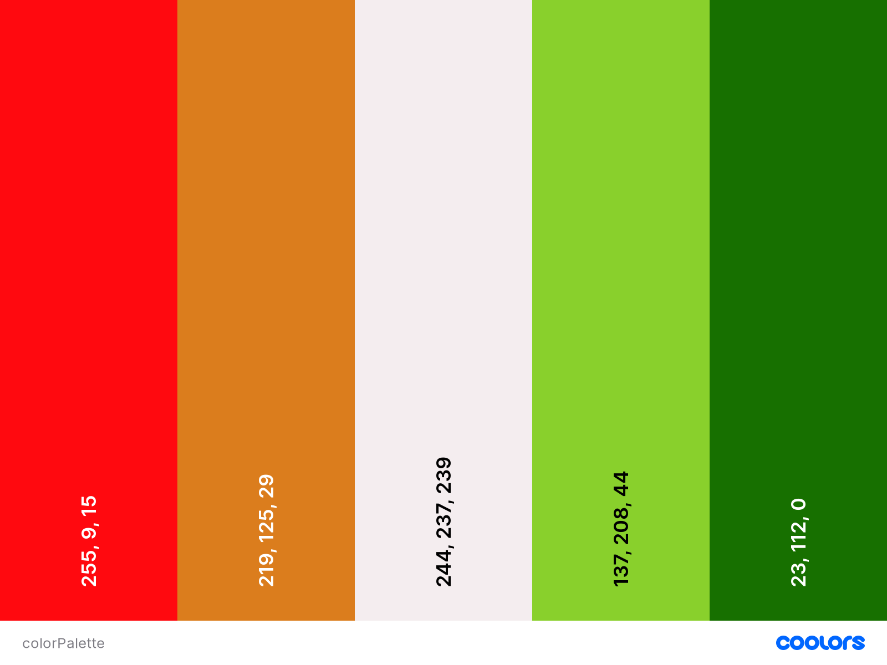

# Pastafari
 

  
  

### Pasta italiana auténtica en la puerta de tu casa con tan solo un click.

## Acerca del proyecto

- Pastafari es nuestra cadena de restaurantes donde podrás disfrutar de la auténtica pasta italiana y vivir la verdadera tradición de compartir. Pastafari se especializa en vender diversos tipos de platillos de pasta a domicilio a lo largo de la República Mexicana. 
- Nuestra audencia objetivo sera cualquier persona con antojo y ganas de probar un platillo realizado con pasta autentica Italiana.
- Pastafari contará con un menu interactivo con el cual los clientes puedan order la pasta que más les interese.
    - Dentro de los productos ofertados en el menú se podrá encontrar platillos como: 
        1. Fetuccini Alla Puttanesca
        2. Trenette Al Pesto
        3. Pansotti Alla Genovese
        4. Vermicelli Con Le Vongole

## Integrantes

1. Angel Tamariz
2. Mario Mercado
    - Polímata y narrador de rol de mesa, mis gustos son variados y espero que lo que sé ayude en nuestro proyecto.
4. Mario Menchaca
5. Gerardo Linares
    - Estudiante de Ing. en Sistemas computacionales. Resido en la CDMX y mi fortaleza es el back-end. Me gusta mucho leer y aprender nuevas tecnologías.

## Paginas de referencia

[GRIND coffee](https://grind.co.uk/)

Página que se dedica a la venta de café, cafeteras y pods. Presenta una estética muy limpia con una paleta de colores muy sobria lo que hace resaltar al producto. La página es dinámica y cuenta con menús muy útiles.
- Gerardo Linares

[Blue Apron](https://www.blueapron.com/)

Esta es una reconocida página que vende alimentos frescos, aquí lo que me gusta es la sencillez de explicación sobre lo que hacen y que inmediatamente (gracias a sus imágenes) sabes de que va la página.
- Mario Mercado

[Simply Chocolate](https://simplychocolate.dk/)

[Pogg Sweetp potato pie](https://pogg-sweetpotatopie.com/en/)

[Air Company](https://aircompany.com/):

Las elegí por que me parece que tienen un muy buen diseño, son bastante limpias y fáciles de usar aunque son tiendas de temas variados
- Angel Tamariz

## Paleta de Color
 

  
  

## Fonts

- Roboto
- Pacifico
### Construido con:

* Javascript
* HTML5
* CSS
* [Node.js](https://nodejs.org/en/)

(<a href="#top">Regresar Arriba</a>)

